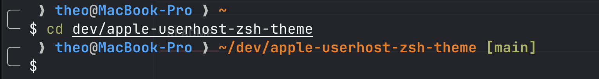

# apple-userhost

A custom Oh My Zsh theme: a 2-line prompt with an apple icon, `user@hostname`, path, and git status.



```
╭─  ❯ theo@MacBook-Pro ❯ ~/dev/apple-userhost-zsh-theme [main]
╰─ $
```

- ` ❯` (apple) and the `╭─`/`╰─` bars: white
- `user@hostname`: blue (256-color `39`), bold
- path (`%~`): orange (256-color `208`), bold
- git status (`[branch+]`): green

## Installation

1. Copy (or symlink) `apple-userhost.zsh-theme` into `$ZSH_CUSTOM/themes/`:

   ```sh
   ln -s /path/to/apple-userhost-zsh-theme/apple-userhost.zsh-theme \
         "${ZSH_CUSTOM:-$HOME/.oh-my-zsh/custom}/themes/apple-userhost.zsh-theme"
   ```

2. In `~/.zshrc`, set the theme:

   ```sh
   ZSH_THEME="apple-userhost"
   ```

3. Reload your shell: `source ~/.zshrc`.

## Customizing colors

Every element has its own variable at the top of `apple-userhost.zsh-theme` — just change the value (color name or 256-color code) and reload your shell:

| Variable         | Element                           | Default          |
|------------------|-------------------------------------|-------------------|
| `APPLE_COLOR`    | apple ` ❯`                         | `white`           |
| `USER_COLOR`     | `user` (before the `@`)             | `39` (blue)       |
| `HOST_COLOR`     | `hostname` (after the `@`)          | `39` (blue)       |
| `AT_COLOR`       | the `@`                             | `white`           |
| `CHEVRON_COLOR`  | the `❯` after the host              | `white`           |
| `PATH_COLOR`     | the current path (`%~`)             | `208` (orange)    |
| `BAR_COLOR`      | the `╭─` / `╰─` bars                | `white`           |
| `GIT_COLOR`      | git status `[branch+]`              | `green`           |

256-color table: `for i in {0..255}; do print -Pn "%F{$i}%3d %f" $i; (( (i+1) % 16 )) || print; done`
